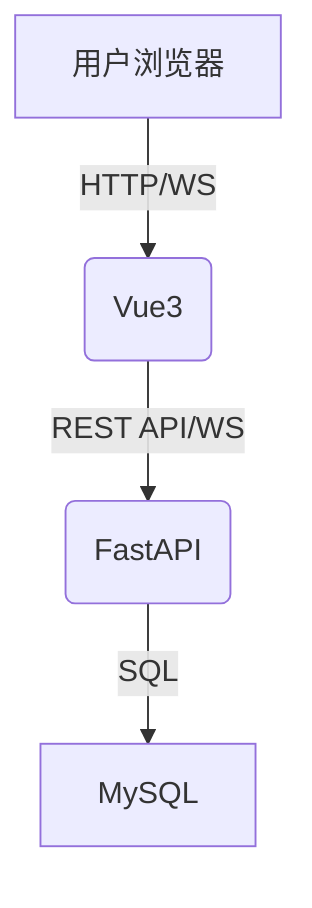

# 实时投票系统

## 系统架构



- 前端：Vue3 + Vite + Chart.js，负责问卷展示、投票、实时数据可视化
- 后端：FastAPI，提供REST API和WebSocket服务
- 数据库：MySQL，存储问卷与投票数据
- 容器化：Docker + docker-compose

---

## API 说明

### 1. 获取问卷

- `GET /api/poll`
- 返回：  
  ```json
  {
    "id": 1,
    "question": "你最喜欢哪种编程语言？",
    "options": [
      {"id": 1, "option_text": "Python", "vote_count": 0},
      ...
    ]
  }
  ```

### 2. 提交投票

- `POST /api/poll/vote`
- 参数：
  ```json
  {
    "poll_id": 1,
    "option_id": 2
  }
  ```
- 返回：
  ```json
  { "success": true }
  ```

---

## WebSocket 推送机制

- 地址：`ws://<后端地址>:8000/ws/poll`
- 连接后，后端会在有投票时推送如下数据：
  ```json
  {
    "poll_id": 1,
    "options": [
      {"id": 1, "option_text": "Python", "vote_count": 10},
      ...
    ]
  }
  ```
- 前端收到后自动刷新柱状图和选项票数

---

## 本地部署

1. 安装 Docker 和 docker-compose
2. 在项目根目录执行：
   ```bash
   docker-compose up --build
   ```
3. 访问前端：http://localhost:5173

---

## 单元测试

- 后端：`cd backend && pytest`
- 前端：`cd frontend && npm run test`

---

## 前端美化建议

- 使用渐变背景和圆角卡片风格，提升视觉层次感
- 投票按钮采用渐变色和阴影，增强点击感
- 柱状图配色明快，适当动画
- 响应式布局，移动端友好
- 适当增加投票后感谢语和交互反馈

---

## 其他说明

- 本系统为匿名投票，未做用户身份校验
- 支持多用户实时同步
- 可扩展多问卷、多题目 